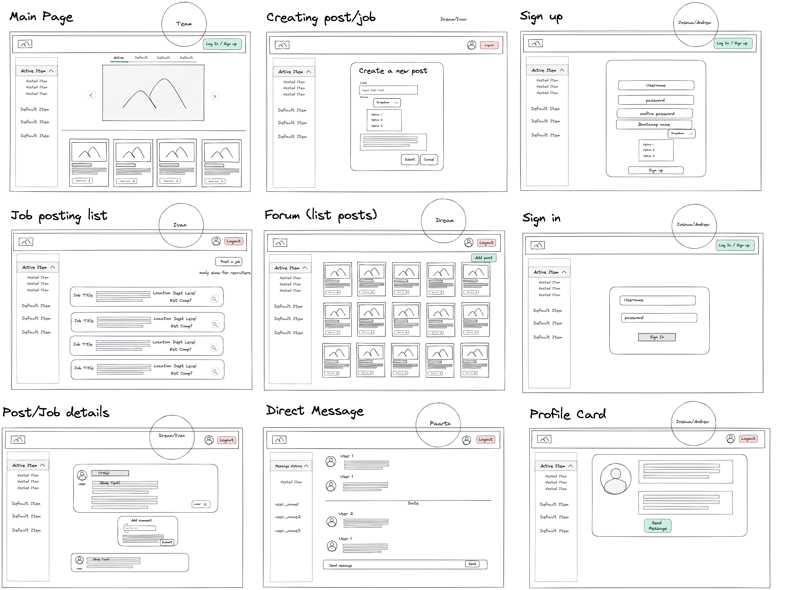

# Novice Network
A  social media platform designed exclusively for coding bootcamp graduates to connect, collaborate, and grow together. Novice Network is more than just a website; it's a vibrant community that fosters continuous learning, professional development, and lasting relationships among its members. Just like coding bootcamps have revolutionized the way people learn to code, Novice Network aims to revolutionize how coding bootcamp graduates connect and thrive in the tech industry. Novice Network understands the importance of a strong professional network which members can access job postings

## Team:
* **Andrew Morales**
* **Apitchaya (Dream) Ramirez**
* **Ivan Tsang**
* **Joshua Contreras**
* **Paarth Joshi**

## Design
- [API Design](attachments/apidesign.MD)
- [Data Models](attachments/datamodel.MD)
- GHI

## Functionality
1. As a new user, I can sign up as a bootcamper/grad, recruiter, mentor
2. As a user, I can log in so I can access my profile
3. As a user, I can edit my profile
4. As a bootcamper/grad/mentor, I can create a post
5. As a bootcamper/grad/mentor, I can comment on my own and others’ posts
6. As a recruiter, I can post a new job
7. As a recruiter, I can edit my job posts
8. As a bootcamper/grad/mentor/recruiter, I can browse a job board

## Project Initialization
1. Clone the repository down to your local machine
2. CD into the new project directory
3. Run `docker volume create postgres-data`
4. Run `docker compose build`
5. Run `docker compose up`
6. Run `docker exec -it novice-network-fastapi-1 bash`
7. Try out Novice Network on your browser http://localhost:3000/
